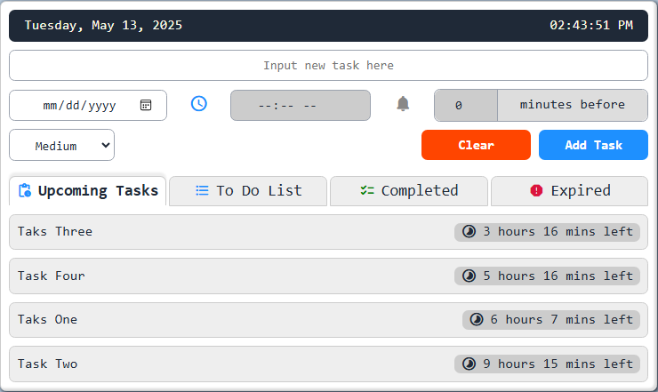
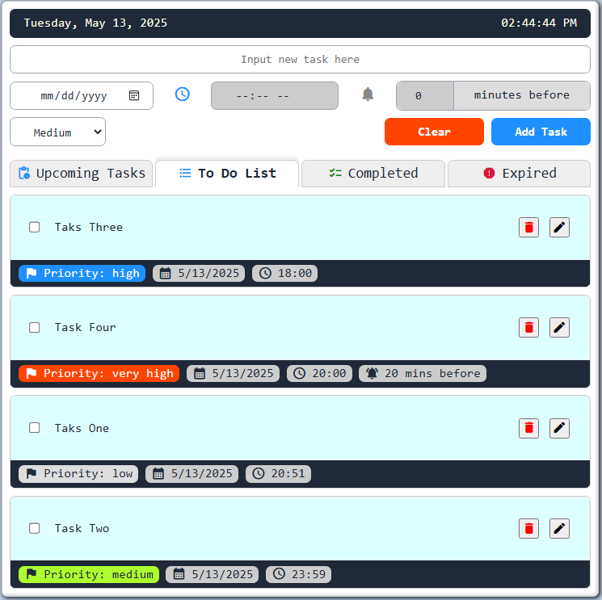
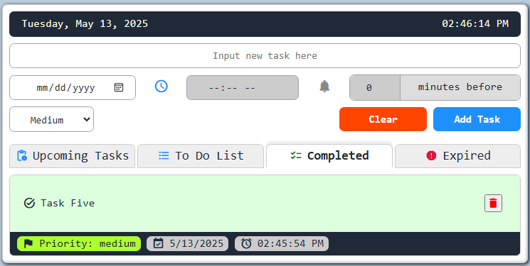
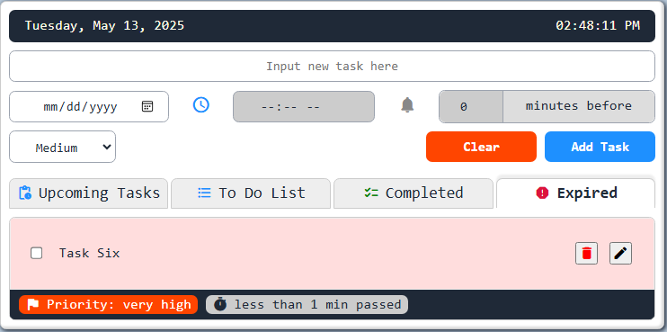

# 📝 To-Do List Web App

A responsive, interactive to-do list web application that allows users to add, manage, and track tasks with reminders and priorities. Built with **HTML**, **CSS**, and **JavaScript**, this project demonstrates client-side task management features with a focus on user experience and design.

---

## Table of Contents

- [Tech Stack](#teck-stack)
- [Features](#features)
- [Screenshot](#screenshot)
- [Project Structure](#project-structure)
- [Feature Improvements](#feature-improvements)
- [Known Issues](#known-issues)
- [Changelog](#changelog)
- [License](#license)
- [Author](#author)

---

## 🔧 Tech Stack

- **HTML5** – Markup structure  
- **CSS3** – Styling and layout  
- **JavaScript (Vanilla)** – Functionality and interaction  
- **Material Icons** – Icons  
- **Local Storage** – Saving tasks persistently in the browser  

---

## ✨ Features

- **Task Creation** 
  Add tasks with a title, date, time, priority, and a pre-task reminder.
- **Reminder System** 
  Schedule alerts before task start time using customizable minute intervals.
- **Task Management**
  - Mark tasks as complete
  - Edit or delete tasks instantly
- **Live Clock**
  Displays current system time at the top of the app.
- **Live Time Countdown**
   Displays the remaining time for upcoming tasks (e.g., “57 mins left”, “4 hours 56 mins left”).
- **Task Categories/Tabs**
  - `Upcoming Tasks`: shows only tasks scheduled for the future.
  - `To Do List`: shows all active tasks.
  - `Completed`: shows tasks marked as done with green highlighting.
  - `Expired`: (based on earlier screenshot) shows overdue tasks.
- **Completed Task View**
  - Marked tasks are moved to the Completed tab.
  - Still displays priority and deadline information.
  - UI turns green for visual confirmation.
- **Priority-Based Styling**
   Priority color coding persists across all tabs for easy recognition.
- **Clean & Responsive Layout**
   Layout adapts and clearly separates tasks with visual cues and section headers.

---

## 📸 Screenshot









---

## 📁 Project Structure

```
todo-app/
├── assets/                		# Contains static assets like images, icons, etc.
├── js/                    		# Core application JavaScript files
│   ├── controller/        		# Handles application logic and user interactions
│   │   └── App.js          	# Main application controller
│   ├── models/             	# Defines data structures and business logic
│   │   └── Task.js         	# Represents a single to-do task
│   ├── services/           	# Provides reusable functionalities and utilities
│   │   ├── DateTimeManager.js  # Manages date and time related operations
│   │   ├── NotificationServices.js # Handles in-app notifications
│   │   └── TaskManager.js  	# Manages the collection of tasks (add, delete, update)
│   └── views/              	# Responsible for rendering the UI
│       ├── Renderer.js     	# Manages rendering updates to the DOM
│       └── main.js         	# Entry point for initializing the application
├── style/                  	# Contains all CSS files for styling the application
│   ├── base.css            	# Base styles, resets, and typography
│   ├── form.css            	# Styles for form elements
│   ├── layout.css          	# Defines the overall page layout
│   ├── lists.css           	# Styles for list elements (e.g., task list)
│   ├── main.css            	# Main application-wide styles
│   ├── notifications.css   	# Styles for notification messages
│   ├── status-bar.css      	# Styles for any status bar elements
│   ├── style_minimal.css   	# Potentially a minimal or alternative style theme
│   ├── task.css            	# Specific styles for individual task items
│   └── themes.css          	# Defines different themes or color schemes
├── .gitignore              	# Specifies intentionally untracked files to ignore
├── index.html              	# The main HTML file where the React app is mounted
├── LICENSE                 	# License file for the project
└── README.md               	# This README file
```

---

## 🛠 How to Run Locally

1. Clone the repo
```bash
git clone https://github.com/Hooman-Siadat/todo-app.git
```

2. open the `index.html` in any browser.

That’s it. no server needed!

---

## 📌 Future Improvements

- Add drag-and-drop task reordering
- Add search and filter options
- Support for recurring tasks
- Optional dark mode
- Support IndexedDB
- Improve stylesheet (use variables)

---

## 🐞 Known Issues

- No back-end — tasks are only saved in the browser’s local storage.
- Some reminders may not trigger if the tab is inactive for long periods (depends on browser behavior).

---

## 🔄 Changelog

### [v1.0.4] - 2025-05-17

Refactor: Organized style.css into separate modules for better maintainability

- main: all the styles in proper order.
- base: CSS reset and basic stylings.
- layout: general layout of the app.
- form: form section stylings.
- lists: upcoming, active, completed, expired lists stylings.
- task: individual tasks stylings.
- status-bar: tasks status bar and info spans stylings.
- notifications: pop up on screen notifications stylings.

### [v1.0.3] - 2025-05-16

Refactor: Organized codebase into separate modules for better maintainability

- Moved task-related logic to models/Task.js
- Extracted services (TaskManager, DateTimeManager, NotificationService)
- Created views/Renderer.js and controllers/App.js
- Updated main.js as entry point

### [v1.0.2] - 2025-05-14

- Fixed notification offset validation logic which allowed the user to select an offset with no time set.
- Cleaned up some minor debugging codes.
- Revised the logic so it will return all the upcoming tasks scheduled for the same time.
- Added a helper function so it will track all the created `setTimeout`s and clears them properly.

### [v1.0.1] - 2025-05-14

- Added on screen notification messaging system.

### [v1.0] - 2025-05-13

- Initial release with task creation, completion toggle, and deletion.

---

## 📄 License

This project is open source and available under the MIT License.

---

## 🙋‍♂️ Author

Built with passion by Hooman Siadat.

GitHub: [@Hooman-Siadat](https://github.com/Hooman-Siadat)
